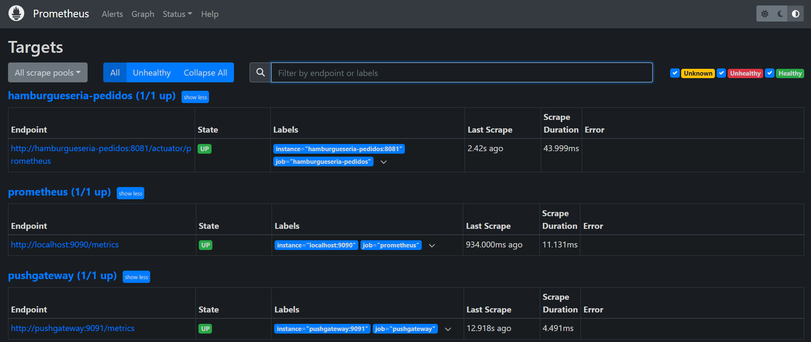
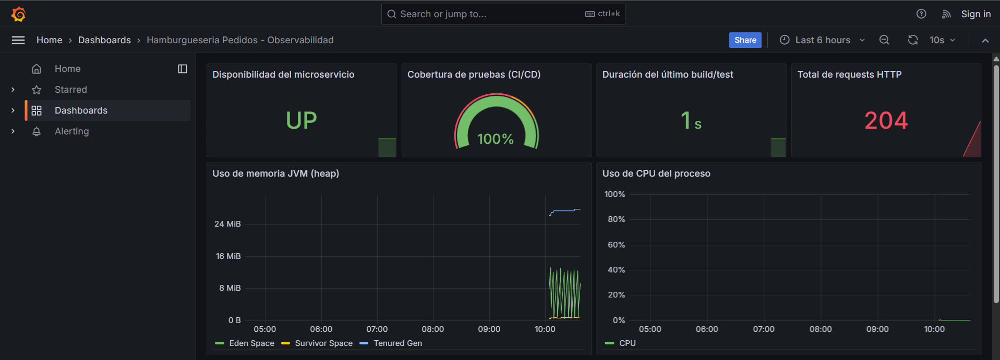
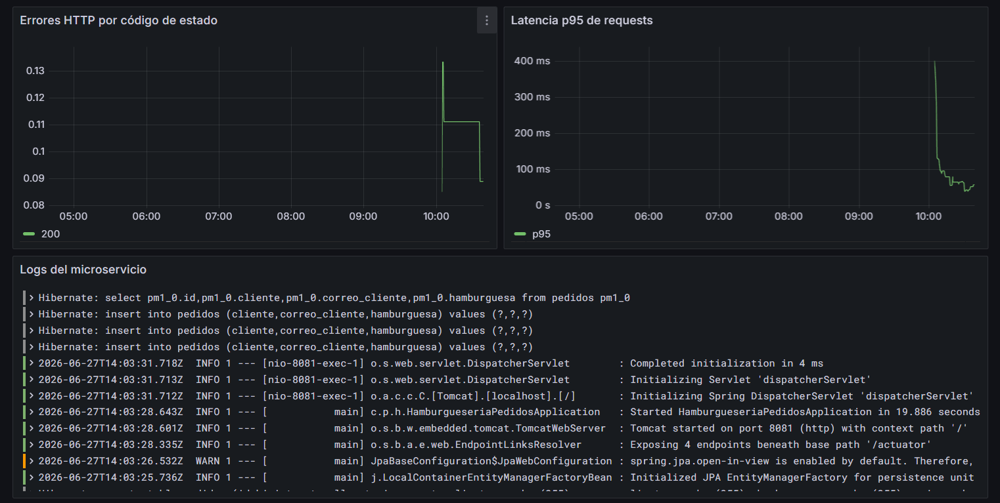

# Hamburgueseria Pedidos - Microservicio

Microservicio REST para la gestión de pedidos de una hamburguesería. Desarrollado con **Spring Boot 3.5** y **Java 21**, con pipeline CI/CD completo implementado en **GitHub Actions**, orquestación de contenedores mediante **Docker Compose**, y una capa de **observabilidad, métricas y cumplimiento normativo** (Evaluación Parcial 3) con Prometheus, Grafana, Loki y Snyk.

---

## Tabla de Contenidos

1. [Descripción del Microservicio](#descripción-del-microservicio)
2. [Arquitectura](#arquitectura)
3. [Endpoints de la API](#endpoints-de-la-api)
4. [Cómo ejecutar localmente](#cómo-ejecutar-localmente)
5. [Docker Compose](#docker-compose)
6. [Pipeline CI/CD](#pipeline-cicd)
7. [Pruebas y Calidad](#pruebas-y-calidad)
8. [Seguridad](#seguridad)
9. [Trazabilidad](#trazabilidad)
10. [Observabilidad y Monitoreo (IE1)](#observabilidad-y-monitoreo-ie1)
11. [Despliegue en la nube - AWS (IE2)](#despliegue-en-la-nube---aws-ie2)
12. [Dashboard de métricas clave (IE3)](#dashboard-de-métricas-clave-ie3)
13. [Cumplimiento y Auditoría Automatizada (IE5)](#cumplimiento-y-auditoría-automatizada-ie5)
14. [Evidencia: el pipeline se detiene ante fallas críticas (IE6)](#evidencia-el-pipeline-se-detiene-ante-fallas-críticas-ie6)
15. [Declaración de uso de Inteligencia Artificial](#declaración-de-uso-de-inteligencia-artificial)

---

## Descripción del Microservicio

Este microservicio expone una API REST para:
- Registrar pedidos de hamburguesas con los datos del cliente
- Consultar todos los pedidos registrados
- Notificar automáticamente al microservicio de notificaciones al crear un pedido

**Tecnologías principales:**
- Java 21 + Spring Boot 3.5
- Spring Data JPA + MySQL 8
- Spring Boot Actuator (health checks)
- Maven (gestión de dependencias y build)

---

## Arquitectura

```
┌─────────────────────────────────────────────────────────┐
│                   Docker Compose Stack                  │
│                                                         │
│  ┌──────────────────┐    ┌──────────────────────────┐  │
│  │  hamburgueseria  │───▶│         MySQL 8           │  │
│  │     -pedidos     │    │    (db_pedidosx:3306)     │  │
│  │   (port: 8081)   │    └──────────────────────────┘  │
│  │                  │                                   │
│  │                  │───▶┌──────────────────────────┐  │
│  └──────────────────┘    │  notificaciones (mock)    │  │
│                          │   MockServer (port:1080)  │  │
│  ┌──────────────────┐    └──────────────────────────┘  │
│  │    Adminer       │                                   │
│  │  (port: 8090)    │──▶ Administración BD             │
│  └──────────────────┘                                   │
└─────────────────────────────────────────────────────────┘
```

---

## Endpoints de la API

| Método | Endpoint       | Descripción                  |
|--------|----------------|------------------------------|
| POST   | /api/pedidos   | Crear un nuevo pedido        |
| GET    | /api/pedidos   | Listar todos los pedidos     |
| GET    | /actuator/health | Health check del servicio  |

### Ejemplo de creación de pedido

```bash
curl -X POST http://localhost:8081/api/pedidos \
  -H "Content-Type: application/json" \
  -d '{
    "cliente": "Juan Pérez",
    "hamburguesa": "Hamburguesa Clásica",
    "correoCliente": "juan@ejemplo.com"
  }'
```

**Respuesta:**
```json
{
  "id": 1,
  "cliente": "Juan Pérez",
  "hamburguesa": "Hamburguesa Clásica",
  "correoCliente": "juan@ejemplo.com"
}
```

---

## Cómo ejecutar localmente

### Requisitos previos
- Java 21+
- Maven 3.9+
- MySQL 8 corriendo en `localhost:3306` con base de datos `db_pedidosx`

### Ejecución sin Docker

```bash
# Clonar el repositorio
git clone <url-del-repositorio>
cd HamburguesaPedidos-main

# Ejecutar pruebas
mvn test

# Compilar y ejecutar
mvn spring-boot:run
```

El servicio estará disponible en `http://localhost:8081`.

---

## Docker Compose

El stack completo incluye: microservicio de pedidos, MySQL, MockServer (notificaciones), Adminer, y la capa de observabilidad (Prometheus, Grafana, Loki, Promtail, Pushgateway).

### Pre-configuración

```bash
# 1. Copiar el archivo de variables de entorno
cp .env.example .env

# 2. (Opcional) Ajustar valores en .env según tu entorno
```

### Levantar el stack

```bash
docker compose up --build -d
```

### Verificar el estado

```bash
docker compose ps
```

### Puertos expuestos

| Servicio               | Puerto Host | Descripción                          |
|------------------------|-------------|---------------------------------------|
| hamburgueseria-pedidos | 8081        | API REST del microservicio           |
| MySQL                  | 3306        | Base de datos                        |
| notificaciones (mock)  | 8082        | Mock del servicio de notif.          |
| Adminer                | 8090        | Interfaz web de administración       |
| Prometheus             | 9090        | Recolección de métricas              |
| Pushgateway            | 9091        | Ingesta de métricas del pipeline CI  |
| Grafana                | 3001        | Dashboards de observabilidad         |
| Loki / Promtail        | (interno)   | Agregación de logs de contenedores   |

### Apagar el stack

```bash
docker compose down -v
```

### Componentes del Docker Compose

El archivo `docker-compose.yml` incluye todos los componentes exigidos:

| Componente | Implementación |
|------------|----------------|
| Definición de servicios | `hamburgueseria-pedidos`, `mysql`, `notificaciones`, `adminer`, `prometheus`, `pushgateway`, `loki`, `promtail`, `grafana` |
| Redes personalizadas | `hamburgueseria-network` (bridge) |
| Variables de entorno | Configuradas por servicio, sobreescribibles vía `.env` |
| Volúmenes persistentes | `mysql-data`, `prometheus-data`, `loki-data`, `grafana-data` |
| Mapeo de puertos | Host:Contenedor para cada servicio |
| Dependencias entre servicios | `depends_on` con `condition: service_healthy` |
| Health checks | Configurados en todos los servicios principales |
| Estrategia de reinicio | `restart: unless-stopped` |
| Límites de recursos | `deploy.resources.limits` de memoria por servicio |
| Imágenes públicas y propias | `mysql:8.0`, `adminer`, `mockserver`, `prometheus`, `grafana`, `loki`, `promtail`, `pushgateway` + `build: .` |
| Provisioning automático | Datasources y dashboard de Grafana se cargan solos al iniciar (sin configuración manual en la UI) |

---

## Pipeline CI/CD

El pipeline se implementa en GitHub Actions (`.github/workflows/ci-cd.yml`) y cubre el ciclo completo desde el código fuente hasta el despliegue simulado.

### Diagrama del Pipeline

```
push/PR
   │
   ▼
┌──────────┐
│  BUILD   │  mvn clean package -DskipTests
└────┬─────┘
     │
     ├───────────────┬───────────────┐
     ▼               ▼               ▼
┌──────────┐   ┌───────────┐  ┌───────────┐
│   TEST   │   │    SCA    │  │   SNYK    │
│ (JaCoCo) │   │  (OWASP)  │  │(cumplim.) │
│ ≥60% cov │   │ CVSS < 9  │  │ informa-  │
│ +push    │   │ BLOQUEA   │  │ tivo      │
│ metricas │   │ el deploy │  │           │
└────┬─────┘   └─────┬─────┘  └───────────┘
     │               │ (si falla, no continua)
     └───────┬───────┘
             ▼
      ┌──────────┐
      │   SAST   │
      │SonarCloud│
      └────┬─────┘
           │
  ┌────────┴────────┐
  ▼                 ▼
┌──────────┐     ┌──────────┐
│  DOCKER  │     │   SAST   │
│  BUILD   │     │ (espera) │
│(hadolint)│     └──────────┘
└────┬─────┘
     │ (solo en main, y solo si SCA no bloqueó)
     ▼
┌──────────┐
│  DEPLOY  │
│  (Docker │
│  Compose │
│ +Observ.)│
└──────────┘
```

### Jobs del pipeline

| Job | Herramienta | Propósito | ¿Bloquea? |
|-----|-------------|-----------|-----------|
| Build | Maven | Compila el proyecto | Sí |
| Test | JUnit 5 + JaCoCo | Ejecuta pruebas, verifica cobertura ≥ 60% y publica métricas a Pushgateway | Sí (cobertura) |
| SCA | OWASP Dependency Check | Analiza vulnerabilidades en dependencias | **Sí (CVSS ≥ 9, ver IE6)** |
| Snyk | Snyk | Política de cumplimiento adicional: reporta vulnerabilidades con otra fuente de datos | No (informativo) |
| SAST | SonarCloud | Análisis estático de calidad y seguridad | No (informativo) |
| Docker Build | Docker Buildx + Hadolint | Construye y verifica la imagen Docker | Sí (lint) |
| Deploy | Docker Compose | Despliegue simulado con stack completo + observabilidad | Depende de SCA/Docker Build |

### Configurar SonarCloud (Esto es opcional)

1. Crear cuenta en [sonarcloud.io](https://sonarcloud.io)
2. Importar el repositorio de GitHub
3. Agregar los siguientes secretos/variables en el repositorio de GitHub:
   - **Secret:** `SONAR_TOKEN` → Token de autenticación de SonarCloud
   - **Variable:** `SONAR_ORGANIZATION` → Nombre de la organización en SonarCloud

> Si no se configura SonarCloud, el job SAST mostrará un mensaje informativo indicando los pasos para activarlo, y el pipeline continuará sin bloquearse.

### Configurar NVD API Key (opcional, acelera OWASP)

1. Obtener API key en [nvd.nist.gov](https://nvd.nist.gov/developers/request-an-api-key)
2. Agregar **Secret:** `NVD_API_KEY` en el repositorio de GitHub

### Configurar Snyk (cumplimiento, IE5)

1. Crear cuenta en [snyk.io](https://snyk.io) e importar el repositorio de GitHub
2. Agregar **Secret:** `SNYK_TOKEN` → token de autenticación de Snyk
3. Agregar **Variable:** `SNYK_TOKEN_CONFIGURED=true`
4. Invitar como colaborador a la organización de Snyk al usuario del docente (ver sección de Cumplimiento)

### Configurar métricas de pipeline en Grafana (IE3)

1. Agregar **Variable:** `PUSHGATEWAY_URL` con la URL pública del Pushgateway (ej. `http://<ip-publica-ec2>:9091`) para que el job Test publique cobertura y duración del build automáticamente en cada ejecución del pipeline.
2. Si no se configura, el pipeline omite este paso sin fallar (el resto de los jobs no se ven afectados).

---

## Pruebas y Calidad

### Ejecutar pruebas localmente

```bash
# Solo pruebas unitarias
mvn test

# Pruebas + reporte de cobertura + verificación umbral 60%
mvn verify

# Reporte de cobertura disponible en:
# target/site/jacoco/index.html
```

### Cobertura de pruebas

| Clase | Pruebas |
|-------|---------|
| `PedidoController` | `PedidoControllerTest` (4 tests con MockMvc) |
| `PedidoService` | `PedidoServiceTest` (4 tests con Mockito) |
| `PedidoRepository` | `PedidoRepositoryTest` (5 tests con @DataJpaTest + H2) |

**Umbral mínimo:** 60% de cobertura de líneas. El build falla si no se alcanza.

### Análisis de dependencias (SCA)

```bash
mvn dependency-check:check

# Reporte disponible en:
# target/dependency-check-report.html
```

---

## Seguridad

### Controles de seguridad en el pipeline

| Control | Herramienta | Acción |
|---------|-------------|--------|
| Cobertura mínima | JaCoCo | Bloquea build si < 60% |
| CVEs críticos | OWASP Dependency Check | **Bloquea Docker Build y Deploy si CVSS ≥ 9** |
| Cumplimiento adicional | Snyk | Reporta vulnerabilidades (segunda fuente de datos) |
| Calidad de código | SonarCloud | Reporta calidad y code smells |
| Calidad del Dockerfile | Hadolint | Bloquea en errores críticos |
| Actualizaciones automáticas | Dependabot | PRs automáticos semanales |

### Seguridad en contenedores

- La imagen Docker corre con un **usuario no-root** (`appuser`)
- Build multi-etapa: la imagen final no contiene Maven ni código fuente
- Variables sensibles gestionadas vía archivo `.env` (no comprometido en git)
- Health checks activos para detectar fallos de servicio

### .gitignore recomendado

Asegurarse de que `.env` esté en `.gitignore` para no exponer credenciales:

```
.env
target/
*.jar
```

---

## Trazabilidad

La trazabilidad del código desde desarrollo hasta producción se garantiza mediante:

1. **Control de versiones:** Cada commit en `main` o `develop` dispara el pipeline
2. **Build reproducible:** Maven genera artefactos JAR versionados (`0.0.1-SNAPSHOT`)
3. **Imagen etiquetada:** La imagen Docker se etiqueta con el SHA del commit (`hamburgueseria-pedidos:<sha>`)
4. **Artefactos del pipeline:** JAR, reporte JaCoCo, reporte OWASP guardados como artefactos de GitHub Actions
5. **Gate de calidad:** El despliegue solo ocurre si build + test + SCA pasan (ver [Evidencia IE6](#evidencia-el-pipeline-se-detiene-ante-fallas-críticas-ie6))
6. **Logs de contenedores:** Disponibles vía `docker compose logs` y centralizados en Grafana Loki
7. **Health checks:** El endpoint `/actuator/health` permite verificar el estado en cualquier momento
8. **Dependabot:** PRs automáticos para mantener dependencias actualizadas y seguras

---

## Observabilidad y Monitoreo (IE1)

El stack de observabilidad se basa en **Prometheus** (métricas), **Grafana** (visualización) y **Loki + Promtail** (logs centralizados). Todo se levanta junto al resto de los servicios con `docker compose up --build -d`, sin configuración manual: los datasources y el dashboard de Grafana se auto-provisionan al iniciar.

### Qué se observa

| Aspecto exigido por la pauta | Cómo se cubre |
|---|---|
| Logs | Promtail recolecta los logs de **todos** los contenedores (vía Docker socket) y los envía a Loki. Se visualizan en el panel "Logs del microservicio" de Grafana. |
| Métricas de uso | Micrometer expone métricas JVM/HTTP en `/actuator/prometheus` (requests, latencia, memoria, CPU). Prometheus las recolecta cada 15s. |
| Errores | Panel "Errores HTTP por código de estado" (tasa de respuestas 4xx/5xx en tiempo real). |
| Disponibilidad | Métrica `up{job="hamburgueseria-pedidos"}` indica si el microservicio está arriba o caído (panel "Disponibilidad"). |

### Cómo verificarlo localmente

```bash
docker compose up --build -d
# Esperar ~30s a que todos los servicios estén healthy
docker compose ps
```

- Prometheus: http://localhost:9090 (ver en *Status → Targets* que `hamburgueseria-pedidos` está **UP**)
- Grafana: http://localhost:3001 (acceso anónimo en modo *Viewer* habilitado; usuario admin: `admin` / contraseña en `.env`)
- Métricas crudas del microservicio: http://localhost:8081/actuator/prometheus

**Evidencia:** Prometheus detecta los 3 targets (microservicio, prometheus, pushgateway) en estado `UP`:



---

## Despliegue en la nube - AWS (IE2)

Tal como indicó el docente por correo, **no se usa Kubernetes** (contenido no cubierto en el curso). El despliegue en la nube se realiza con el mismo `docker-compose.yml` sobre una instancia **EC2 de AWS Academy (Learner Lab)**, lo que garantiza que la configuración (red, healthchecks, provisioning de Grafana, volúmenes) es idéntica a la que corre en local — no hay pasos manuales de configuración dentro de cada herramienta.

### Pasos para recrear el despliegue en EC2

1. Iniciar el Learner Lab y lanzar una instancia EC2 (Ubuntu 22.04, tipo `t3.medium` o superior recomendado por la cantidad de contenedores).
2. Configurar el Security Group de la instancia para permitir entrada en los puertos: `22` (SSH), `8081` (API), `3001` (Grafana), `9090` (Prometheus), `9091` (Pushgateway), `8090` (Adminer).
3. Conectarse por SSH e instalar Docker + Docker Compose:
   ```bash
   sudo apt-get update && sudo apt-get install -y docker.io docker-compose-plugin
   sudo usermod -aG docker $USER && newgrp docker
   ```
4. Clonar el repositorio y levantar el stack:
   ```bash
   git clone -b feature/observabilidad-ep3 https://github.com/paloma-fm/HamburguesaPedidos.git
   cd HamburguesaPedidos
   cp .env.example .env
   docker compose up --build -d
   ```
5. Acceder desde el navegador usando la IP pública de la instancia: `http://<IP_PUBLICA>:3001` (Grafana), `http://<IP_PUBLICA>:8081/api/pedidos` (API), etc.

> **Nota sobre disponibilidad:** AWS Academy Learner Lab tiene presupuesto y duración acotados por módulo del curso. Se deja la instancia corriendo para que el docente pueda ingresar directamente durante la semana de revisión; como respaldo, esta sección y la de Observabilidad incluyen capturas de pantalla del mismo stack funcionando, por si el laboratorio se reinicia antes de la revisión.

**Acceso para el docente (completar antes de enviar el correo/AVA):**
- URL Grafana: `http://___________:3001` (acceso anónimo, rol Viewer — no requiere login)
- URL Prometheus: `http://___________:9090`
- URL API: `http://___________:8081/api/pedidos`

> **Captura sugerida:** consola de AWS Academy mostrando la instancia EC2 "running", y el Security Group con los puertos abiertos.

---

## Dashboard de métricas clave (IE3)

El dashboard "Hamburgueseria Pedidos - Observabilidad" se auto-provisiona en Grafana (`docker/grafana/dashboards/hamburgueseria-dashboard.json`) e incluye exactamente las métricas pedidas por la pauta:

| Métrica exigida | Panel en Grafana | Origen del dato |
|---|---|---|
| Tiempo de despliegue | "Duración del último build/test" | `pipeline_build_duration_seconds`, enviado por `scripts/push-pipeline-metrics.sh` a Pushgateway tras cada `mvn verify` |
| Cobertura de pruebas | "Cobertura de pruebas (CI/CD)" | `pipeline_test_coverage_percent`, calculado desde `target/site/jacoco/jacoco.xml` |
| Uso de CPU/memoria | "Uso de memoria JVM" y "Uso de CPU del proceso" | Métricas Micrometer (`jvm_memory_used_bytes`, `process_cpu_usage`) |
| Errores registrados | "Errores HTTP por código de estado" | `http_server_requests_seconds_count` agrupado por `status` |

Adicionalmente se incluyen paneles de disponibilidad, latencia p95 y logs en vivo (ver sección de Observabilidad).

### Cómo generar datos para el dashboard

```bash
# 1. Levantar el stack
docker compose up --build -d

# 2. Generar tráfico de prueba
for i in 1 2 3 4 5; do
  curl -s -X POST http://localhost:8081/api/pedidos \
    -H "Content-Type: application/json" \
    -d "{\"cliente\":\"Cliente $i\",\"hamburguesa\":\"Clásica\",\"correoCliente\":\"c$i@test.com\"}"
done
curl -s http://localhost:8081/api/pedidos

# 3. Publicar métricas de cobertura/duración del pipeline
START=$(date +%s)
mvn verify
./scripts/push-pipeline-metrics.sh $START

# 4. Abrir Grafana
# http://localhost:3001
```

**Evidencia:** dashboard completo con datos reales generados por tráfico de prueba (disponibilidad, cobertura, duración de build, requests, memoria, CPU):



Errores HTTP, latencia p95 y logs en vivo del microservicio (vía Loki):



---

## Cumplimiento y Auditoría Automatizada (IE5)

Se combinan tres mecanismos de cumplimiento, tal como sugiere la pauta:

| Herramienta | Qué audita | Dónde se ejecuta |
|---|---|---|
| **SonarCloud** | Calidad de código, code smells, duplicación, cobertura | Job `sast` en cada push/PR |
| **Snyk** | Vulnerabilidades de dependencias (segunda fuente, complementa a OWASP) | Job `snyk` en cada push/PR |
| **Branch protection rules (GitHub)** | Impide mergear a `main` sin que el pipeline corra; exige PR revisado | Configurado en GitHub → Settings → Rules |
| **OWASP Dependency Check** | CVEs críticos en dependencias; es el gate que efectivamente detiene el pipeline (ver IE6) | Job `sca` |

### Acceso para el docente

Por solicitud del profesor, se debe otorgar acceso público o invitar a los siguientes usuarios:

- **SonarCloud:** invitar a `nico@singh.cl` (Nico Singh) como miembro de la organización, o dejar el proyecto en modo público.
- **Snyk:** invitar a `nico@singh.cl` (Nico Singh) como colaborador de la organización/proyecto en snyk.io.
- **GitHub:** invitar a `nicosingh` (nico@singh.cl) como colaborador del repositorio si se mantiene privado.

> **Captura sugerida:** pantalla de SonarCloud con el proyecto analizado (quality gate) y pantalla de Snyk con el reporte de vulnerabilidades del proyecto.

---

## Evidencia: el pipeline se detiene ante fallas críticas (IE6)

El mecanismo de bloqueo **no es simulado**: el job `sca` (OWASP Dependency Check) usa `failBuildOnCVSS=9` **sin** `continue-on-error` y **sin** supresiones en esta rama. Spring Boot 3.5.13 y Tomcat 10.1.x tienen actualmente CVEs reales con CVSS 9.1–9.8 (ej. `CVE-2026-40974`, `CVE-2026-41293`) en dependencias transitivas, por lo que el job falla genuinamente.

### Cómo se propaga la detención

```
sca (OWASP) FALLA  →  docker-build se omite (needs: [test, sca])  →  deploy se omite (needs: [docker-build, sast])
```

Es decir: ante una vulnerabilidad crítica real, **el pipeline nunca llega a construir la imagen Docker ni a desplegar**, protegiendo el entorno productivo simulado.

Adicionalmente, el job `test` aplica el mismo principio para la **calidad**: si la cobertura de pruebas cae bajo 60% (`jacoco-maven-plugin`, regla `jacoco-check`), el build de Maven falla y ningún job posterior se ejecuta.

| Tipo de falla crítica | Gate que la detiene | ¿Bloquea sin `continue-on-error`? |
|---|---|---|
| CVE con CVSS ≥ 9 en dependencias | Job `sca` (OWASP) | Sí |
| Cobertura de pruebas < 60% | `mvn verify` (JaCoCo check, fase `verify`) | Sí |
| Dockerfile con errores críticos de lint | Hadolint en job `docker-build` | Sí |

> **Captura sugerida:** ejecución de GitHub Actions de esta rama mostrando el job `sca` en rojo y los jobs `docker-build`/`deploy` en gris/omitidos ("skipped"). Incluir también el log del job `sca` con el CVE específico que provocó la falla.

Para comprobarlo en tu propia ejecución: ve a la pestaña **Actions** del repositorio, abre el run más reciente de esta rama y observa que `docker-build` y `deploy` aparecen como *Skipped*, no como *Success*.

---

## Declaración de uso de Inteligencia Artificial

En cumplimiento de la política de uso ético de IA del curso ([bibliotecas.duoc.cl/ia](https://bibliotecas.duoc.cl/ia)):

- **Herramienta usada:** Claude Code (Anthropic), como asistente de programación.
- **Cómo se usó:** apoyo para generar configuración de infraestructura (archivos YAML de Docker Compose, Prometheus, Loki, Grafana, GitHub Actions), redacción y estructuración de esta documentación, y diagramas en texto plano.
- **Qué NO se generó con IA:** las decisiones de diseño (qué herramientas usar y por qué, cómo resolver la tensión entre "pipeline siempre verde" vs. "demostrar que se detiene ante fallas críticas"), la justificación técnica de cada indicador, y las reflexiones individuales de cierre, fueron escritas y validadas por el/la estudiante.
- **Validación:** todo el código y configuración generado fue ejecutado y probado localmente (`docker compose up`) antes de incluirse en la entrega.
